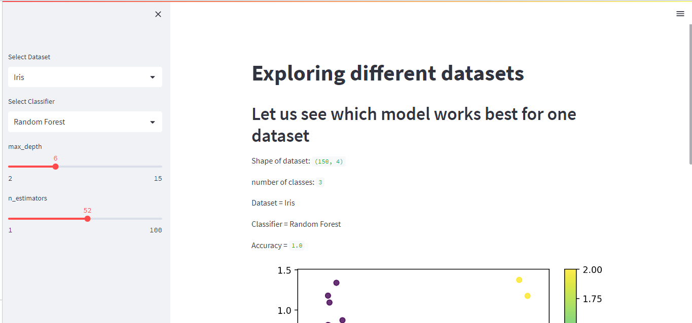
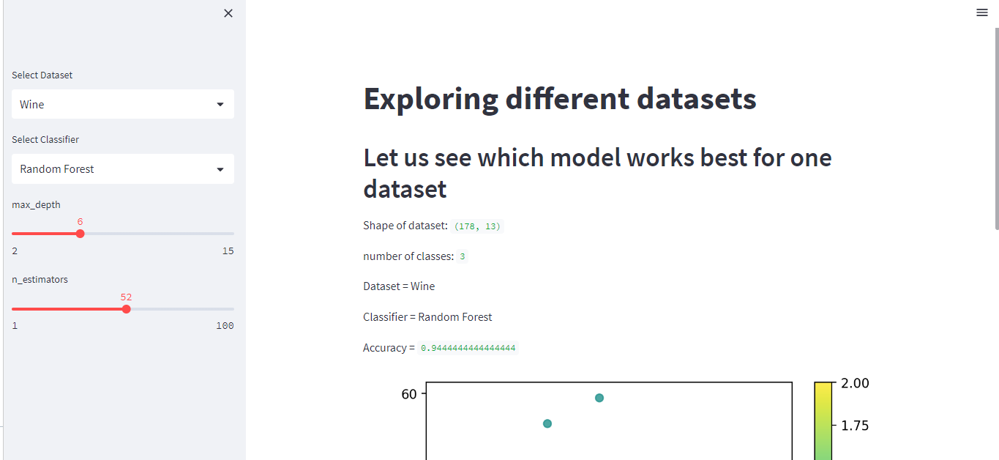
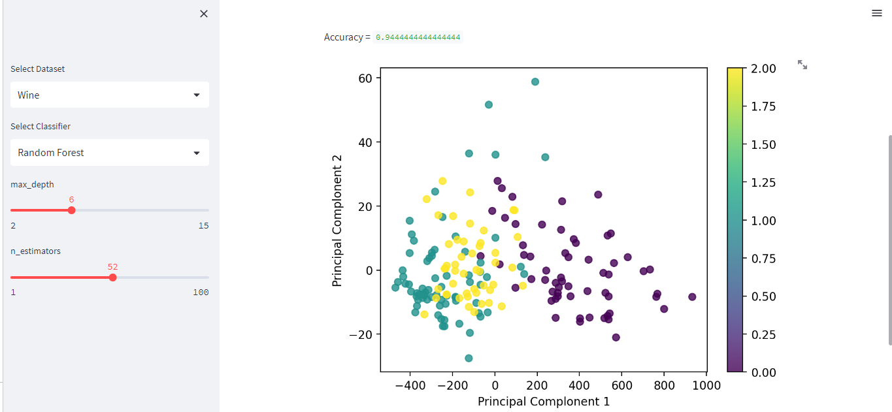

# ML Algorithm Explorer 
## Streamlit App

This Streamlit web app allows you to explore the performance of different machine learning algorithms on various datasets.

### Run on Streamlit

You can view this app on Streamlit at: [ML Explorer on Streamlit](https://classifier-web-app.streamlit.app)

## 1. Features:

- **Dataset Selection:** Choose from a variety of built-in datasets (Iris, Breast Cancer, Wine).
- **Classifier Selection:** Experiment with different classification algorithms (KNN, SVM, Random Forest).
- **Interactive Parameter Tuning:** Customize model hyperparameters using interactive sliders.
- **Accuracy Evaluation:** View the model's accuracy on a held-out test set.
- **Data Visualization:** Explore the dataset's distribution through a PCA-based scatter plot.

## 2. Requirements:

- Python 3.x
- Streamlit (`pip install streamlit`)
- NumPy (`pip install numpy`)
- Matplotlib (`pip install matplotlib`)
- scikit-learn (`pip install scikit-learn`)

## 3. Datasets

We are using three different datasets, including:

- Breast Cancer
- Iris
- wine

## 4. Models

We are using following three classification models:

- KNN
- SVM
- Random Forest

## 5. Running the App:

1. Open a terminal in the project directory.
2. Run the app: `streamlit run app.py`
3. Access the app in your web browser (usually at http://localhost:8501).

## 6. Usage:

1. Select a dataset from the sidebar.
2. Choose a classifier from the sidebar.
3. Adjust model hyperparameters using the sliders (if available for the selected classifier).
4. Click the "Run" button (or similar) to train the model and evaluate its performance.
5. View the classification accuracy and a PCA-based scatter plot of the dataset.

## 7. Exploration Tips:

- Try different datasets and classifiers to observe how model performance varies.
- Experiment with different hyperparameter settings to potentially improve accuracy.
- Consider the characteristics of each dataset and classifier to make informed choices.
- Use the scatter plot to visualize the dataset's distribution and potential class separation.

## 8. Working

By running the app, we can vary different factors in each model and incerase the accuracy of input dataset.  

## Screen Capture  

### KNN  

  

#### Graph  

  

## SVM  

  

#### Graph  

  

## Random Forrest  

### IRIS dataset

  

#### Graph  
  

### Wines dataset  

  

#### Graph  

  
