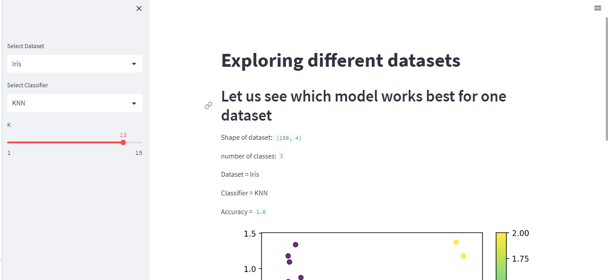
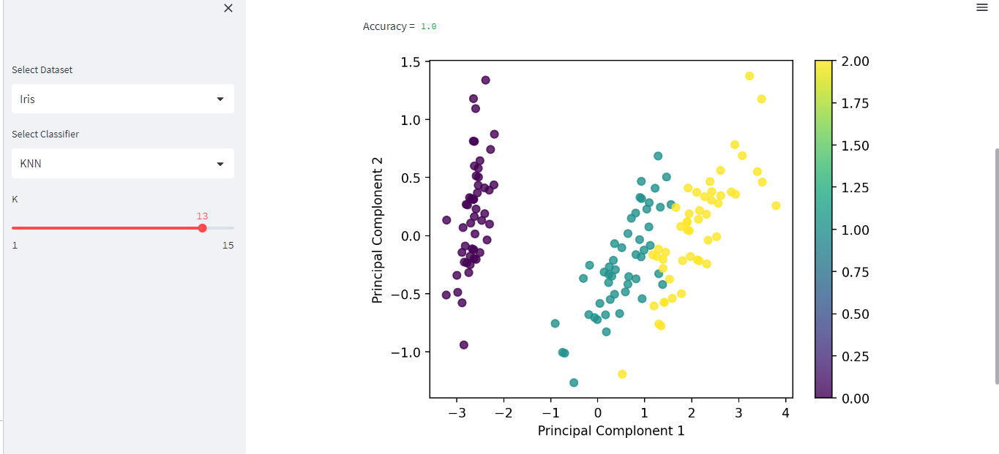

# CLASSIFIER WEB APP

You can view this app on Streamlit at: [streamlit Classifier Web App](https://classifier-web-app.streamlit.app)

This is a streamlit repository for classification web apps. We depend on following libraries:

* streamlit
* numpy
* matplotlib
* sklearn

We are using three different datasets, including:

1. Breast Cancer
2. Iris
3. wine

We are using following three classification models:

1. KNN
2. SVM
3. Random Forest

By creating a streamlit app, we can vary different factors in each model and incerase the accuracy of input dataset.  

## Screen Capture  

### KNN  

  
#### Graph  
  

## SVM  

  
#### Graph  
  

## Random Forrest  

### IRIS dataset

  
#### Graph  
  

### Wines dataset  

  
#### Graph  
  

